# 📋 区域销售经理 — 入职培训 + 学分制带教计划

> **岗位**: 区域销售经理
> **带教责任人**: 总监/副总 | **上司**: 敖日格勒 / 王珂 | **HR**: 凌云/陆蓓 | **助理**: 洪丽丽

---

## 一、培训全流程（Mermaid 流程图）

```mermaid
flowchart TB
  %% ======== 入口 ========
  START([新员工入职<br>区域销售经理]) --> MOD1[版块一：入职培训<br>必选 · 入职三天内]

  %% ======== 版块一：入职培训 ========
  subgraph M1[版块一：入职培训]
    direction TB
    M1_TITLE((入职三天内))
    M1_HR[【公司制度 · HR负责】]
    M1_HR1[入职手续办理]
    M1_HR2[合同签订]
    M1_HR3[员工手册发放]
    M1_HR4[组织架构介绍]
    M1_HR5[MBO面谈]
    M1_HR6[参观公司总部]
    M1_HR7[HR总监面谈]
    M1_HR8[产品资料库链接传递]
    M1_HR1 & M1_HR2 & M1_HR3 & M1_HR4 & M1_HR5 & M1_HR6 & M1_HR7 & M1_HR8 --> M1_ONBOARD_DONE

    M1_SV[【培训准备 · 上司负责】]
    M1_SV1[讲解责任田划分]
    M1_SV2[讲解框架和经销商]
    M1_SV3[讲解政策和产品]
    M1_SV4[安排月会沟通]
    M1_SV5[MBO设置和解读]
    M1_SV6[月会模板解读]
    M1_SV7[制定一周带教新人计划]
    M1_SV1 & M1_SV2 & M1_SV3 & M1_SV4 & M1_SV5 & M1_SV6 & M1_SV7 --> M1_ONBOARD_DONE

    M1_AS[【工作流程 · 助理团队负责】]
    M1_AS1[跟进一周带教计划]
    M1_AS2[CRM日报系统讲解]
    M1_AS3[财务报销制度讲解]
    M1_AS4[会议制度讲解]
    M1_AS5[战略报告 & 任务数字解读]
    M1_AS1 & M1_AS2 & M1_AS3 & M1_AS4 & M1_AS5 --> M1_ONBOARD_DONE

    M1_ONBOARD_DONE{入职培训验收} -->|互评报告| M1_END[✅ 版块一完成]
  end

  MOD1 --> MOD1_DECIDE{是否新任<br>主管以上？}
  MOD1_DECIDE -->|是| MOD2[版块二：小灶培训<br>可选 · 入职一个月内]
  MOD1_DECIDE -->|否| MOD3[版块三：集中培训<br>必选 · 入职三个月内]

  %% ======== 版块二：小灶培训 ========
  subgraph M2[版块二：小灶培训]
    direction TB
    M2_TITLE((入职一个月内 · 可选))
    M2_1[团队管理运作<br>MBO设定、月会模板] -->|各销售总监| M2_DONE
    M2_2[渠道管理 · 新渠道开发] -->|王珂·销售常务副总| M2_DONE
    M2_3[市场管理 · 政策理解运用] -->|吴婉青·市场部总监| M2_DONE
    M2_4[招标管理和数字管理] -->|各销售总监| M2_DONE
    M2_5[客户管理 · 意向开发维护] -->|待定| M2_DONE
    M2_6[团队及人才管理<br>健全团队、选择人才] -->|何其华·HR总监| M2_DONE
    M2_7[认知培训<br>逻辑和批判性思维] -->|CEO彭总| M2_DONE
    M2_DONE{小灶培训验收} -->|互评报告| M2_END[✅ 版块二完成]
  end

  MOD2 --> MOD3

  %% ======== 版块三：集中培训 ========
  subgraph M3[版块三：集中培训]
    direction TB
    M3_TITLE((入职三个月内 · 必选))
    M3_PREP[① 扫盲考准备]
    M3_PREP1[E-learning系统自学<br>初级专业知识扫盲] --> M3_PREP_EXAM{通过扫盲考试？}
    M3_PREP_EXAM -->|未通过| M3_PREP1
    M3_PREP_EXAM -->|通过| M3_CAMP

    M3_CAMP[② 上海办公室新人培训营<br>压缩为三天]
    M3_D1[第一天<br>企业制度合规说明<br>IT系统使用] -->|市场部总监| M3_CAMP_DONE
    M3_D2[第二天<br>产品知识讲解<br>血尿·凝血·渠道·生免] -->|生免·市场经理/总监| M3_CAMP_DONE
    M3_D3[第三天<br>专业知识标准重点解读<br>血尿·生免·凝血标准] -->|学术总监/副总| M3_CAMP_DONE

    M3_CAMP_DONE --> M3_FINAL
    M3_FINAL[③ 结业考试]
    M3_FINAL1[结业考试 + 培训反馈] -->|E-learning · 一周内| M3_RESULT{通过？}
    M3_RESULT -->|未通过| M3_FINAL1
    M3_RESULT -->|通过| M3_END[✅ 版块三完成]
  end

  MOD3 --> CREDIT[学分制带教<br>阶段一到三 · 各1~2个月]

  %% ======== 学分制带教：第一阶段 ========
  subgraph S1[第一阶段 · 1~2个月]
    direction TB
    S1_TITLE((第一阶段))
    S1_PROD[产品理论知识培训]
    S1_P1[血球产品基础培训] --> S1_EXAM1
    S1_P2[尿液产品基础培训] --> S1_EXAM1
    S1_P3[凝血产品基础培训] --> S1_EXAM1

    S1_POL[市场政策学习]
    S1_POL1[血球产品政策] --> S1_POL_DONE
    S1_POL2[尿液产品政策] --> S1_POL_DONE
    S1_POL3[凝血产品政策] --> S1_POL_DONE

    S1_NUM[任务数字确认]
    S1_N1[血球任务数字] --> S1_NUM_DONE
    S1_N2[尿液任务数字] --> S1_NUM_DONE
    S1_N3[凝血任务数字] --> S1_NUM_DONE

    S1_FIELD[现场带教]
    S1_F1[代理商拜访带教] --> S1_FIELD_DONE
    S1_F2[客户拜访带教] --> S1_FIELD_DONE

    S1_EXAM1("验收：三个明白考试<br>HR打分 5分") --> S1_CHECK
    S1_POL_DONE("验收：市场部 5分") --> S1_CHECK
    S1_NUM_DONE("验收：战略课 5分") --> S1_CHECK
    S1_FIELD_DONE("验收：互评报告") --> S1_CHECK
    S1_CHECK{全部通过？} -->|是| S1_END[✅ 第一阶段完成]
    S1_CHECK -->|否| S1_RETRY[补考/重修]
    S1_RETRY --> S1_EXAM1
  end

  CREDIT --> S1

  %% ======== 学分制带教：第二阶段 ========
  subgraph S2[第二阶段 · 1~2个月]
    direction TB
    S2_TITLE((第二阶段))
    S2_PROD[产品理论知识培训]
    S2_P1[免疫产品培训] --> S2_EXAM1
    S2_P2[生化产品培训] --> S2_EXAM1
    S2_P3[糖化产品培训] --> S2_EXAM1
    S2_P4[Alifax产品培训] --> S2_EXAM1
    S2_P5[尿液提案培训] --> S2_EXAM1
    S2_P6[血球提案培训] --> S2_EXAM1
    S2_P7[凝血提案培训] --> S2_EXAM1

    S2_POL[市场政策学习]
    S2_POL1[免疫产品政策] --> S2_POL_DONE
    S2_POL2[生化产品政策] --> S2_POL_DONE
    S2_POL3[糖化产品政策] --> S2_POL_DONE
    S2_POL4[Alifax产品政策] --> S2_POL_DONE

    S2_NUM[任务数字确认]
    S2_N1[免疫任务数字] --> S2_NUM_DONE
    S2_N2[生化任务数字] --> S2_NUM_DONE
    S2_N3[Alifax任务数字] --> S2_NUM_DONE

    S2_FIELD[现场带教]
    S2_F1[渠道谈判带教] --> S2_FIELD_DONE
    S2_F2[客户提案带教] --> S2_FIELD_DONE
    S2_F3[区域KOL拜访带教] --> S2_FIELD_DONE

    S2_EXAM1("验收：三个明白考试<br>HR打分 5分") --> S2_CHECK
    S2_POL_DONE("验收：市场部 5分") --> S2_CHECK
    S2_NUM_DONE("验收：战略课 5分") --> S2_CHECK
    S2_FIELD_DONE("验收：互评报告") --> S2_CHECK
    S2_CHECK{全部通过？} -->|是| S2_END[✅ 第二阶段完成]
    S2_CHECK -->|否| S2_RETRY[补考/重修]
    S2_RETRY --> S2_EXAM1
  end

  S1 --> S2

  %% ======== 学分制带教：第三阶段 ========
  subgraph S3[第三阶段 · 1~2个月]
    direction TB
    S3_TITLE((第三阶段))
    S3_PROD[产品理论知识培训]
    S3_P1[生命科学产品] --> S3_EXAM1
    S3_P2[免疫提案培训] --> S3_EXAM1

    S3_BID[招标培训]
    S3_B1[血球招标培训] --> S3_BID_DONE
    S3_B2[尿液招标培训] --> S3_BID_DONE
    S3_B3[凝血招标培训] --> S3_BID_DONE
    S3_B4[糖化招标培训] --> S3_BID_DONE
    S3_B5[Alifax招标培训] --> S3_BID_DONE

    S3_FIELD[现场带教]
    S3_F1[压货谈判带教] --> S3_FIELD_DONE
    S3_F2[现场招标带教] --> S3_FIELD_DONE

    S3_EXAM1("验收：三个明白考试<br>HR打分 5分") --> S3_CHECK
    S3_BID_DONE("验收：各负责人") --> S3_CHECK
    S3_FIELD_DONE("验收：互评报告<br>凌云打分") --> S3_CHECK
    S3_CHECK{全部通过？} -->|是| S3_END[✅ 第三阶段完成]
    S3_CHECK -->|否| S3_RETRY[补考/重修]
    S3_RETRY --> S3_EXAM1
  end

  S2 --> S3

  %% ======== 最终汇总 ========
  S3_END --> SUMMARY[📊 个人学分制汇总]
  SUMMARY --> FINAL1[学分成绩汇总]
  FINAL1 --> FINAL2{是否转正？}
  FINAL2 -->|是| PASS[🎉 正式转正<br>培训完成]
  FINAL2 -->|否| EXTEND[延长考核期]
  EXTEND --> FINAL2
```



---

## 二、课程建议方案

### 🟦 版块一：入职培训（三天内）

| 现有课程 | 问题 | 建议 |
|---------|------|------|
| 入职手续/合同/员工手册 | 均为 HR 流程性工作，信息量低 | ✅ 制作"新人入职清单"数字化表单，新人扫码即可自助完成，HR 后台确认即可 |
| 组织架构介绍 | 纯被动听讲，记忆留存率低 | ✅ 改为"组织架构拼图游戏"，让新人自己填空，加深记忆 |
| MBO 面谈 | 入职当天面谈，新人尚无业务认知 | ✅ 建议推迟到入职第 3 天进行，先完成基础培训后再谈目标 |
| 参观公司总部 | 仅对经理级以上提供 | ✅ 增加 VR 云参观/3D 办公室导览，远程入职员工也能感受公司环境 |
| 产品资料库链接 | 仅发链接无引导 | ✅ 制作"产品资料库导览地图"，标注核心文档和推荐学习顺序 |
| 一周带教计划 | 上司从零制定，效率低 | ✅ 建立标准化带教计划模板库，按场景分类（新人/转岗/晋升） |
| CRM/报销/会议制度 | 纯讲解缺实操 | ✅ 改为"实操闯关"：在测试系统完成一次真实流程操作才算过关 |

### 🟥 版块二：小灶培训（一个月内 · 可选）

| 现有课程 | 问题 | 建议 |
|---------|------|------|
| 团队管理（各销售总监） | 不同总监讲法不一，质量不可控 | ✅ 制作标准化管理案例库（含真实 MBO 案例、月会模板示范），统一授课基础 |
| 渠道管理（王珂·常务副总） | 副总级时间难协调 | ✅ 录制 30 分钟精华视频 + 线上 Q&A 答疑，降低协调成本 |
| 市场管理（吴婉青·市场部总监） | 偏理论灌输 | ✅ 增加"政策解读实战"：给 3 个真实场景（竞品冲击/新品上市/集采变化），模拟制定应对方案 |
| 招标管理（各销售总监） | 与阶段三招标培训重叠 | ✅ 明确定位差异：小灶讲"管理视角"，阶段三讲"操作视角" |
| 客户管理（讲师待定） | 最薄弱环节 | ✅ 优先确定讲师，建议覆盖：客户分级管理、意向客户跟踪漏斗、关系维护 SOP |
| 团队及人才管理（何总监） | 缺实操工具 | ✅ 增加"人才盘点演练"，用模拟数据练习识别高潜人才 |
| 认知培训（CEO 彭总） | 时间有限 | ✅ 拆分为"学前阅读 + 线下工作坊"，线下聚焦真实业务决策复盘 |

> **新增建议课程**：
> - 经销商管理实战（筛选/评估/退出）
> - 合规与反商业贿赂专题（行业特有风险案例）

### 🟩 版块三：集中培训（三个月内）

| 现有课程 | 问题 | 建议 |
|---------|------|------|
| E-learning 扫盲自学 | 缺乏监督易拖延 | ✅ 引入"学习打卡 + 阶段测验"：每周设里程碑，完成 30%/60%/90% 各一次小测 |
| 第一天：制度合规 | 信息量大、枯燥 | ✅ 改为"合规密室逃脱"：5~6 个合规场景题，答错扣分，增加互动性 |
| 第二天：产品知识（血尿凝血生免） | 一天覆盖太多，信息过载 | ✅ 建议拆为两天：半天生免单独安排，现有 3 天改为 3.5 天 |
| 第三天：标准解读（学术总监） | 偏理论 | ✅ 增加"标准对照实战"：用真实检测报告练习判断结果、模拟客户答疑 |
| 结业考试（E-learning） | 纯选择题，易死记硬背 | ✅ 增加口试/案例分析（占 40%）：给定模拟场景，现场解答由带教经理评分 |

### 🟠 第一阶段：血球/尿液/凝血（1~2 个月）

| 现有课程 | 问题 | 建议 |
|---------|------|------|
| 三个明白考试（HR 5分） | 缺实战检验 | ✅ 增加"产品演练"：模拟向客户介绍产品并录音，上司+HR 共同评分占 50% |
| 市场政策学习（大客户经理） | 带教时间有限 | ✅ 制作"政策速查手册"（口袋书/手机版），含核心政策 + 常见问答案例 |
| 任务数字确认（上司） | 单纯告知 | ✅ 改为"数字复盘工作坊"：新人用自己的话复述数字来源、拆解逻辑、达成路径 |
| 代理商拜访带教（上司） | 被动跟随 | ✅ 第二次拜访让新人主导 30% 沟通（开场白/产品介绍），结束后复盘 |
| 客户拜访带教 | 缺结构化反馈 | ✅ 使用"拜访评估表"：客户画像/需求挖掘/异议处理/收尾行动各 5 分 |

### 🟣 第二阶段：免疫/生化/糖化/Alifax（1~2 个月）

| 现有课程 | 问题 | 建议 |
|---------|------|------|
| 7 个产品培训 | 产品线长、密集度高 | ✅ 优先排序：免疫(核心战略)→最多学时，生化→侧重差异化卖点，糖化+Alifax→自学+QA |
| 3 个提案培训（大客户经理） | 与产品培训分离 | ✅ "产品+提案一体化"：学完产品立即实践对应提案技巧 |
| 渠道谈判带教（凌云打分） | 缺少谈判准备环节 | ✅ 引入"谈判准备工作表"：目标/对方利益分析/备选方案/复盘 |
| 区域 KOL 拜访带教 | 缺少 KOL 识别方法 | ✅ 增加"KOL 识别地图"工具：学术会议/论文/临床影响力等维度 |

### 🟩 第三阶段：生命科学/招标/压货（1~2 个月）

| 现有课程 | 问题 | 建议 |
|---------|------|------|
| 生命科学产品培训 | 第三个月才接触 | ✅ 阶段一即安排"产品全景图"概览，到阶段三再深入 |
| 5 个招标培训（分类过细） | 重复性高 | ✅ 合并为"招标通用方法论 + 差异点速查表" |
| 免疫提案培训 | 与阶段二提案递进关系不明确 | ✅ 明确递进：阶段二=基础版，阶段三=进阶版（含竞品对比/异议处理） |
| 压货谈判带教 | 实操风险高 | ✅ 先用沙盘模拟：给虚构数据让学员制定方案并模拟谈判 |
| 现场招标带教 | 参与感弱 | ✅ 安排新人负责招标文件中的一个模块（参数确认/价格测算） |

---

## 三、系统性建议

### 🎯 统一学分换算体系

当前各验收均为独立 5 分，缺乏关联换算，建议：

| 维度 | 权重 | 说明 |
|------|------|------|
| 理论考试 | 40% | 三个明白考试 + 结业考试 |
| 现场实操 | 30% | 拜访演练、产品讲解、谈判模拟 |
| 互评报告 | 20% | 自评 20% + 带教人评 50% + 总监评 30% |
| 带教经理评价 | 10% | 综合态度、进步幅度、团队融入 |

### 📋 互评报告标准化

建议制定统一模板，包含：
- **自评**（20%）：学习收获、待改进点、下一步计划
- **带教人评**（50%）：知识掌握、实操能力、沟通协作、主动性（各 5 分制）
- **总监评**（30%）：业务理解、市场潜力、团队适配度

### 💻 远程培训保障

大量课程标注"现地/远程"但不区分考核方式：
- 远程学员增加 **视频实操考核**（产品介绍/拜访模拟录制）
- 线上课程设置 **最低观看时长 + 随堂测验**
- 每月 1 次 **远程 1v1 答辩**（带教经理抽检）

### 📊 带教积分制

大客户经理同时带教多个产品，工作量不均衡：
- 每次完成带教获得积分（理论 2 分 / 实操 5 分）
- 积分与 **季度绩效/年终奖** 挂钩
- 季度带教之星额外奖励

### 🔄 阶段串联复习

三阶段之间缺乏串联：
- 每个阶段结束增加 **综合复盘会**（1~2 小时）
- 复盘内容：前序阶段核心知识点快测 + 交叉案例讨论
- 防止"学了后面忘了前面"

### 🏁 转正标准量化

| 总学分 | 结果 |
|--------|------|
| ≥ 85 分 | ✅ 正常转正 |
| 70 ~ 84 分 | ⏳ 延长考核一个月 |
| < 70 分 | ⚠️ 延长两个月 / 劝退 |

---

## 四、课程地图一览

```
时间轴            模块                              关键交付物
─────┼──────────────────────────────────────────────────────────
第1天  │ 版块一：入职培训                             互评报告
      │   ├─ HR: 入职手续/合同/组织架构
      │   ├─ 上司: 责任田/政策/MBO/带教计划
      │   └─ 助理: CRM/报销/会议/战略报告
      │
第1月  │ 版块二：小灶培训（可选·主管以上）             互评报告
      │   7个主题 × 各销售总监/CEO
      │
第2-3月│ 版块三：集中培训                             扫盲考 + 结业考
      │   ├─ E-learning 扫盲自学
      │   ├─ 上海3天培训营
      │   └─ 结业考试
      │
第1-2月│ 第一阶段：血球/尿液/凝血                     三个明白考试(5分)
      │   产品+政策+任务+现场拜访                      市场部(5分)
      │                                                 战略课(5分)
第2-3月│ 第二阶段：免疫/生化/糖化/Alifax              同上
      │   产品+政策+任务+渠道+KOL
      │
第3-4月│ 第三阶段：生命科学/招标/压货                 同上
      │   产品+招标+压货谈判+现场招标
      │
第4月+ │ 📊 学分汇总 → 转正判定                       学分成绩单
```

---

> **生成日期**: 2026-05-26
> **数据来源**: 入职培训+学分制带教计划（区域销售经理）.xlsx
> **流程图**: 支持 Mermaid 渲染的 Markdown 编辑器（如 VS Code / Typora / GitHub）中可预览
